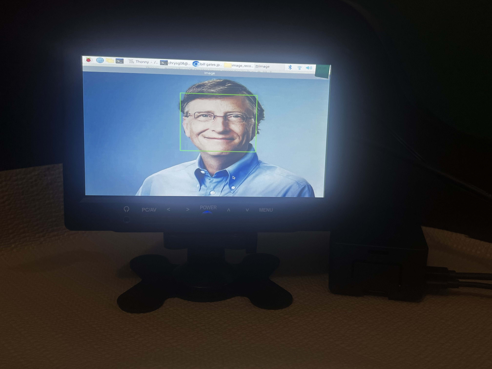
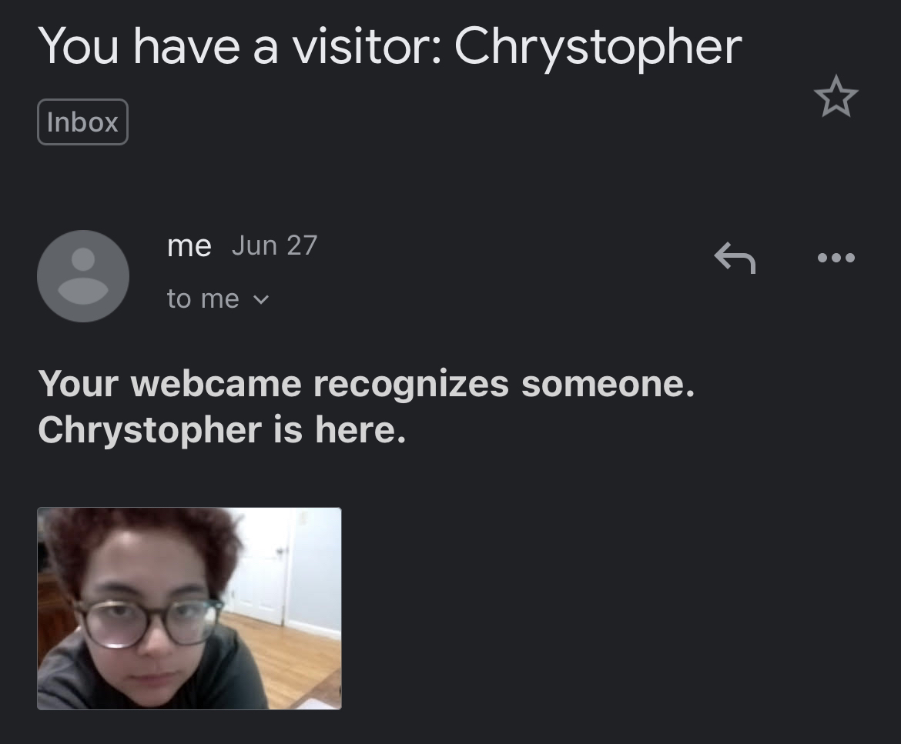
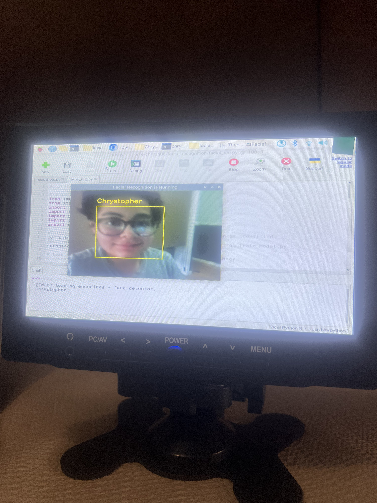
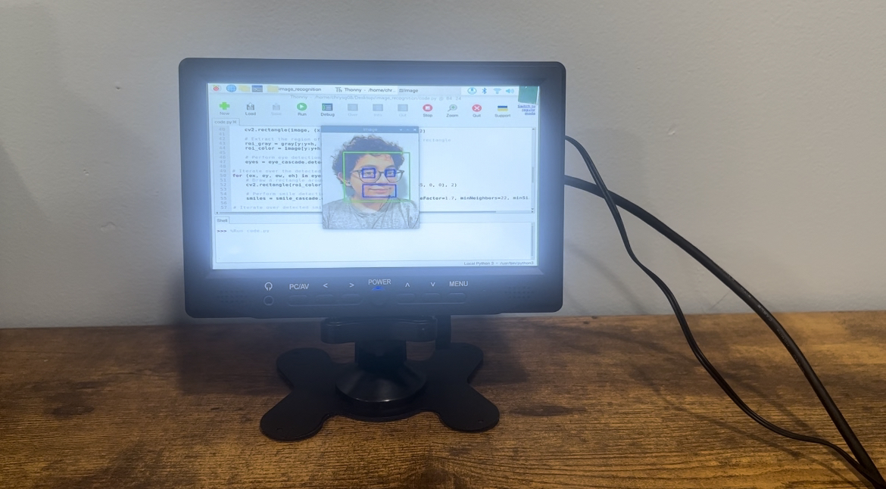
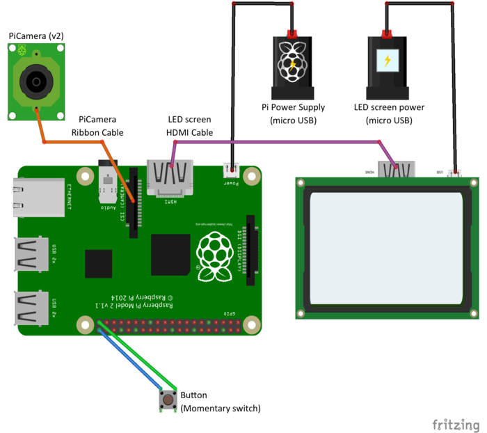

# Rasberry Pi Image and Facial Recognition
My project is Rasberry Pi image and facial recognition. I will be using a Rasberry Pi, camera, and LCD monitor in this project. I will make a project that can detect faces in an image and camera!

| **Engineer** | **School** | **Area of Interest** | **Grade** |
|:--:|:--:|:--:|:--:|
| Chrystopher G | Regis High School | Engineering | Incoming Sophmore


  
# Final Milestone
Since my second milestone, I have setup email notifications to the facial recognition Python code. I modified the code by adding my Twilio SendGrid API key, domain and email address . I saw my name "Chrystopher" in the terminal, followed by "Take a picture" to indicate that the Rasberry Pi camera was taking a picture, and then "Status Code: 202" to indicate that the email had been sent. This email contained my name and a photo attachment.

One of the challenges faced in the third milestone was trying to understand the error in my code. I overcame this by using documentation from Twilio.

If I had more time, the following steps would be taken in the next milestone:
- Emotion Recognition



<iframe width="560" height="315" src="https://www.youtube.com/embed/F7M7imOVGug" title="YouTube video player" frameborder="0" allow="accelerometer; autoplay; clipboard-write; encrypted-media; gyroscope; picture-in-picture; web-share" allowfullscreen></iframe>

# Second Milestone: Facial Recognition
Since my previous milestone, I have enabled and installed the camera module into the Rasberry Pi. I Installed OpenCV by running certain commands into the terminal. I copied the files containing the Python code I needed. Finally, I took photos of myself to train my Rasberry Pi to recognize my face.

One of the challenges faced in the second milestone was enabling the camera.

In future milestones, the challenges to be addressed include:

- The eyes in image recognition detect the mouth as the eyes
- The ears are not detected

To complete the project, the following steps will be taken in the next milestone:

- Setup Email Notifications for Raspberry Pi Facial Recognition



<iframe width="560" height="315" src="https://www.youtube.com/embed/u_gxb7IhWis" title="YouTube video player" frameborder="0" allow="accelerometer; autoplay; clipboard-write; encrypted-media; gyroscope; picture-in-picture; web-share" allowfullscreen></iframe>

# First Milestone: Image Recognition

My first milestone started with setting up the Rasberry pi and LCD monitor. An SD card was inserted into the Pi to supply storage and memory to the computer. Then, I copied code in Thonny and installed OpenCV in the Raspberry Pi terminal to recognize an image. After that, I used an online jpg image for my code. I ran the code.py code, which was able to correctly detect the image's face.

One of the challenges faced in the first milestone was getting the LCD monitor to connect to the Rasberry Pi and receive signal.

In future milestones, the challenges to be addressed include:

- I need a Rasberry Pi camera.
- I hope to code my Rasberry Pi to detect an images' nose, eyes and smile.

To complete the project, the following steps will be taken in the next milestones:

- I will set up the Rasberry Pi camera.
- It will be able to detect my face in the camera.



<iframe width="560" height="315" src="https://www.youtube.com/embed/OXp_PtoNmEI" title="YouTube video player" frameborder="0" allow="accelerometer; autoplay; clipboard-write; encrypted-media; gyroscope; picture-in-picture; web-share" allowfullscreen></iframe>

# Schematics 



# Code
Here's where you'll put your code. The syntax below places it into a block of code. Follow the guide [here]([url](https://www.markdownguide.org/extended-syntax/)) to learn how to customize it to your project needs. 

Milestone 1
```c++
import cv2
import numpy as np

# Load the trained cascade classifier for face detection
face_cascade = cv2.CascadeClassifier('haarcascade_frontalface_default.xml')
eye_cascade = cv2.CascadeClassifier('haarcascade_eye.xml')
smile_cascade = cv2.CascadeClassifier('haarcascade_smile.xml')
left_ear_cascade = cv2.CascadeClassifier('haarcascade_mcs_rightear.xml') 
right_ear_cascade = cv2.CascadeClassifier('haarcascade_mcs_rightear.xml')

# Load the image
image = cv2.imread('image.jpg')

# Convert the image to grayscale
gray = cv2.cvtColor(image, cv2.COLOR_BGR2GRAY)

# Perform face detection
faces = face_cascade.detectMultiScale(gray, scaleFactor=1.1, minNeighbors=5, minSize=(30, 30))

# Iterate over the detected faces
for (x, y, w, h) in faces:
    # Draw a rectangle around the face
    cv2.rectangle(image, (x, y), (x+w, y+h), (0, 255, 0), 2)
    
    # Extract the region of interest (ROI) within the face rectangle
    roi_gray = gray[y:y+h, x:x+w]
    roi_color = image[y:y+h, x:x+w]
    
    # Perform eye detection within the face ROI
    eyes = eye_cascade.detectMultiScale(roi_gray)
    
# Iterate over the detected eyes
for (ex, ey, ew, eh) in eyes:
    # Draw a rectangle around each eye
    cv2.rectangle(roi_color, (ex, ey), (ex+ew, ey+eh), (255, 0, 0), 2)
        
    # Perform smile detection
    smiles = smile_cascade.detectMultiScale(roi_gray, scaleFactor=1.7, minNeighbors=22, minSize=(25, 25))
    
# Iterate over detected smiles
for (sx, sy, sw, sh) in smiles:
    # Draw rectangle around the smile
    cv2.rectangle(roi_color, (sx, sy), (sx+sw, sy+sh), (255, 0, 0), 2)
    
    # Perform ear detection
    left_ear = left_ear_cascade.detectMultiScale(gray, scaleFactor=1.7, minNeighbors=3) 
    right_ear = right_ear_cascade.detectMultiScale(gray, scaleFactor=1.7, minNeighbors=3)

# Iterate over the detected left ear
for (x, y, w, h) in left_ear: 
    # Draw a rectangle around left ear
    cv2.rectangle(frame, (x,y), (x+w,y+h), (0,255,0), 3)
    
# Iterate over the detected right ear
for (x, y, w, h) in right_ear: 
    # Draw a rectangle around right ear
    cv2.rectangle(frame, (x,y), (x+w,y+h), (255,0,0), 3)

# Draw rectangles around the detected faces
for (x, y, w, h) in faces:
    cv2.rectangle(image, (x, y), (x+w, y+h), (0, 255, 0), 2)
    

# Display the image with detected faces
cv2.imshow('Image', image)
cv2.waitKey(0)
cv2.destroyAllWindows()
```
Milestone 2:
```c++
#! /usr/bin/python

# import the necessary packages
from imutils.video import VideoStream
from imutils.video import FPS
import face_recognition
import imutils
import pickle
import time
import cv2

#Initialize 'currentname' to trigger only when a new person is identified.
currentname = "unknown"
#Determine faces from encodings.pickle file model created from train_model.py
encodingsP = "encodings.pickle"

# load the known faces and embeddings along with OpenCV's Haar
# cascade for face detection
print("[INFO] loading encodings + face detector...")
data = pickle.loads(open(encodingsP, "rb").read())

# initialize the video stream and allow the camera sensor to warm up
# Set the ser to the followng
# src = 0 : for the build in single web cam, could be your laptop webcam
# src = 2 : I had to set it to 2 inorder to use the USB webcam attached to my laptop
#vs = VideoStream(src=2,framerate=10).start()
vs = VideoStream(usePiCamera=True).start()
time.sleep(2.0)

# start the FPS counter
fps = FPS().start()

# loop over frames from the video file stream
while True:
	# grab the frame from the threaded video stream and resize it
	# to 500px (to speedup processing)
	frame = vs.read()
	frame = imutils.resize(frame, width=500)
	# Detect the fce boxes
	boxes = face_recognition.face_locations(frame)
	# compute the facial embeddings for each face bounding box
	encodings = face_recognition.face_encodings(frame, boxes)
	names = []

	# loop over the facial embeddings
	for encoding in encodings:
		# attempt to match each face in the input image to our known
		# encodings
		matches = face_recognition.compare_faces(data["encodings"],
			encoding)
		name = "Unknown" #if face is not recognized, then print Unknown

		# check to see if we have found a match
		if True in matches:
			# find the indexes of all matched faces then initialize a
			# dictionary to count the total number of times each face
			# was matched
			matchedIdxs = [i for (i, b) in enumerate(matches) if b]
			counts = {}

			# loop over the matched indexes and maintain a count for
			# each recognized face face
			for i in matchedIdxs:
				name = data["names"][i]
				counts[name] = counts.get(name, 0) + 1

			# determine the recognized face with the largest number
			# of votes (note: in the event of an unlikely tie Python
			# will select first entry in the dictionary)
			name = max(counts, key=counts.get)

			#If someone in your dataset is identified, print their name on the screen
			if currentname != name:
				currentname = name
				print(currentname)

		# update the list of names
		names.append(name)

	# loop over the recognized faces
	for ((top, right, bottom, left), name) in zip(boxes, names):
		# draw the predicted face name on the image - color is in BGR
		cv2.rectangle(frame, (left, top), (right, bottom),
			(0, 255, 225), 2)
		y = top - 15 if top - 15 > 15 else top + 15
		cv2.putText(frame, name, (left, y), cv2.FONT_HERSHEY_SIMPLEX,
			.8, (0, 255, 255), 2)

	# display the image to our screen
	cv2.imshow("Facial Recognition is Running", frame)
	key = cv2.waitKey(1) & 0xFF

	# quit when 'q' key is pressed
	if key == ord("q"):
		break

	# update the FPS counter
	fps.update()

# stop the timer and display FPS information
fps.stop()
print("[INFO] elasped time: {:.2f}".format(fps.elapsed()))
print("[INFO] approx. FPS: {:.2f}".format(fps.fps()))

# do a bit of cleanup
cv2.destroyAllWindows()
vs.stop()
```
Milestone 3
```c++
import os
from dotenv import load_dotenv
load_dotenv()
from imutils.video import VideoStream
from imutils.video import FPS
import face_recognition
import imutils
import pickle
import time
import cv2
from sendgrid import SendGridAPIClient
from sendgrid.helpers.mail import (Mail, Attachment, FileContent, FileName, FileType, Disposition)
import base64

# initialize 'currentname' to trigger only when a new person is identified
currentname = "unknown"
# determine faces from encodings.pickle file model created from train_model.py
encodingsP = "encodings.pickle"
# use this xml file
cascade = "haarcascade_frontalface_default.xml"

def send_email(name):
    message = Mail(
        from_email=os.environ.get('SENDGRID_EMAIL'),
        to_emails=os.environ.get('RECIPIENT_EMAIL'),
        subject='You have a visitor: {}'.format(name),
        html_content='<strong>Your webcame recognizes someone. {} is here.</strong>'.format(name)
    )
    with open('image.jpg', 'rb') as f:
        data = f.read()
        f.close()
    encoded_file = base64.b64encode(data).decode()
    attachedFile = Attachment(
        FileContent(encoded_file),
        FileName('image.jpg'),
        FileType('image/jpg'),
        Disposition('attachment')
    )
    message.attachment = attachedFile
    sg = SendGridAPIClient(os.environ.get('SENDGRID_API_KEY'))
    response = sg.send(message)
    print(response.status_code, response.body, response.headers)
    return response

# load the known faces and embeddings
print("[INFO] loading encodings + face detector...")
data = pickle.loads(open(encodingsP, "rb").read())
detector = cv2.CascadeClassifier(cascade)

# initialize the video stream and allow the camera sensor to warm up
print("[INFO] starting video stream...")
# vs = VideoStream(src=0).start()
vs = VideoStream(usePiCamera=True).start()
time.sleep(2.0)

# start the FPS counter
fps = FPS().start()

# loop over frames from the video file stream
while True:
    # grab the frame from the threaded video stream and resize it
    # to 500px (to speedup processing)
    frame = vs.read()
    frame = imutils.resize(frame, width=500)

    # convert the input frame from (1) BGR to grayscale (for face
    # detection) and (2) from BGR to RGB (for face recognition)
    gray = cv2.cvtColor(frame, cv2.COLOR_BGR2GRAY)
    rgb = cv2.cvtColor(frame, cv2.COLOR_BGR2RGB)

    # detect faces in the grayscale frame
    rects = detector.detectMultiScale(gray, scaleFactor=1.1,
        minNeighbors=5, minSize=(30, 30),
        flags=cv2.CASCADE_SCALE_IMAGE)

    # OpenCV returns bounding box coordinates in (x, y, w, h) order
    # but we need them in (top, right, bottom, left) order, so we
    # need to do a bit of reordering
    boxes = [(y, x + w, y + h, x) for (x, y, w, h) in rects]

    # compute the facial embeddings for each face bounding box
    encodings = face_recognition.face_encodings(rgb, boxes)
    names = []

    # loop over the facial embeddings
    for encoding in encodings:
        # attempt to match each face in the input image to our known encodings
        matches = face_recognition.compare_faces(data["encodings"], encoding)
        name = "Unknown"

        # check to see if we have found a match
        if True in matches:
            # find the indexes of all matched faces then initialize a
            # dictionary to count the total number of times each face
            # was matched
            matchedIdxs = [i for (i, b) in enumerate(matches) if b]
            counts = {}

            # loop over the matched indexes and maintain a count for
            # each recognized face face
            for i in matchedIdxs:
                name = data["names"][i]
                counts[name] = counts.get(name, 0) + 1

            # determine the recognized face with the largest number of
            # votes (note: in the event of an unlikely tie Python will
            # select first entry in the dictionary)
            name = max(counts, key=counts.get)

            # if someone in your dataset is identified
            if currentname != name:
                currentname = name
                print(currentname)
                # take a picture to send in the email
                img_name = "image.jpg"
                cv2.imwrite(img_name, frame)
                print('Taking a picture.')

                # send an email to announce who is at the door
                request = send_email(name)
                if request is not None:
                    print('Status Code: ' + format(request.status_code))  # 202 status code means email sent successfully
                else:
                    print('Failed to send email.')
                    
        names.append(name)

    # loop over the recognized faces
    for ((top, right, bottom, left), name) in zip(boxes, names):
        # draw the predicted face name on the image
        cv2.rectangle(frame, (left, top), (right, bottom), (0, 255, 225), 2)
        y = top - 15 if top - 15 > 15 else top + 15
        cv2.putText(frame, name, (left, y), cv2.FONT_HERSHEY_SIMPLEX, .8, (0, 255, 255), 2)

    # display the image to our screen
    cv2.imshow("Facial Recognition is Running", frame)
    key = cv2.waitKey(1) & 0xFF

    # if the `q` key was pressed, break from the loop
    if key == ord("q"):
        break

    fps.update()

# stop the timer and display FPS information
fps.stop()
print("[INFO] elapsed time: {:.2f}".format(fps.elapsed()))
print("[INFO] approx. FPS: {:.2f}".format(fps.fps()))

cv2.destroyAllWindows()
vs.stop()
```

# Bill of Materials
Here's where you'll list the parts in your project. To add more rows, just copy and paste the example rows below.
Don't forget to place the link of where to buy each component inside the quotation marks in the corresponding row after href =. Follow the guide [here]([url](https://www.markdownguide.org/extended-syntax/)) to learn how to customize this to your project needs. 

| **Part** | **Note** | **Price** | **Link** |
|:--:|:--:|:--:|:--:|
| Raspberry Pi 4B Starter Kit | Image and Facial Recognition | $119.96 (at current time) | <a href="[https://www.amazon.com/Arduino-A000066-ARDUINO-UNO-R3/dp/B008GRTSV6/](https://www.pishop.us/product/raspberry-pi-4b-starter-kit/)"> Link </a> |
|:--:|:--:|:--:|:--:|
| Raspberry Pi Camera Module V2 | Facial Recognition | $29.95 | <a href="[https://www.amazon.com/Arduino-A000066-ARDUINO-UNO-R3/dp/B008GRTSV6](https://www.pishop.us/product/raspberry-pi-camera-module-v2/?src=raspberrypi)"> Link </a> |
|:--:|:--:|:--:|:--:|
| Wireless Keyboard and Mouse (with a Mouse Receiver) | In order to use the LCD monitor | $22.99 | <a href="[https://www.amazon.com/Arduino-A000066-ARDUINO-UNO-R3/dp/B008GRTSV6/](https://www.amazon.com/Wireless-Keyboard-WisFox-Full-Size-Computer/dp/B08R683JVW?th=1)"> Link </a> |
|:--:|:--:|:--:|:--:|
